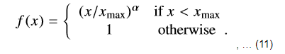
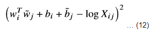
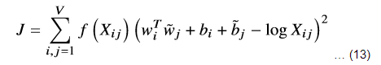
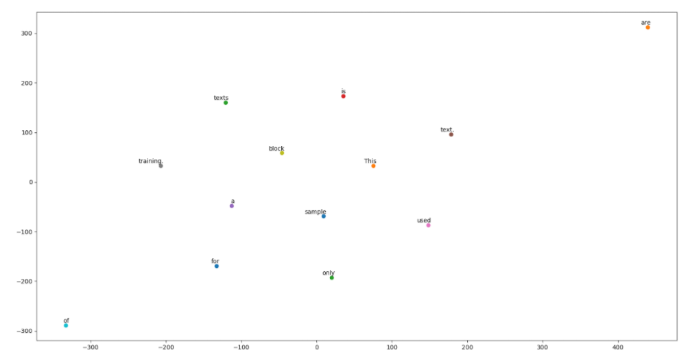

# Automatic Text Summarization
By Anthony Tjuatja

## 1. Introduction
This is a repository containing the project I was undertaking for Sunway University's
Final Year/Capstone Project, concerning the field of NLP and machine learning.
The project consist of extractive-based text summarization algorithm, coded from ground up by myself, and abstractive-based
text summarization algorithm that is taken from TensorFlow sample [textsum](https://github.com/tensorflow/models/tree/master/textsum).
The app was published to the Google Cloud Platform as a flexible app engine instance,
and accessed through REST API.


## 2. Requirements
The module makes use of several dependencies managed using [conda](https://conda.io/docs/index.html), and included in
this repo is the accompanying `yml` environment file in the `condaenv` folder.
You'll need to install conda beforehand, and then specify a pathname to your desired folder that is to
contain the environment & all dependencies.

The following list are the major dependencies :

    2.0 Python 3.5.x
    2.1 Numpy
    2.2 SciPy
    2.3 TensorFlow
    2.4 NLTK (and its dataset)
    2.5 PySpark
    2.6 Flask
    2.7 Google Cloud Storage Library
    2.8 TensorFlow TextSum Abstractive Summarization
    2.9 Anaconda Packages

There are 2 types of dataset required, training dataset and evaluation dataset.
Training dataset is used to improve the capability or understanding of the system.
Evaluation dataset is used to measure the correctness of the summarization algorithm.
### Training Dataset
There are 2 types of training dataset, each for extractive-based text summarization and abstractive-based text summarization algorithm.
This is because abstractive-based text summarization dataset requires the a headline/title of document or article.
Dataset requirements :

    -Extractive Summarization Dataset
        -Any corpus
        -[Existing GloVe model]
    -Abstractive Summarization Dataset
        -Corpus with title and first sentence in article pair.
        -DeepMind Q&A stories dataset (http://cs.nyu.edu/~kcho/DMQA/)

### Evaluation Dataset
The evaluation dataset used is DUC 2003 dataset, which can be requested from [here](http://duc.nist.gov/). There are 4 tasks,
but only task 1 is used.
This is because task 1 is a single document summarization, and the others are not, and so it matches with the purpose and objective of the system.

## 3. Design & Implementation


### 3.1 GloVe
Building a word representation requires it to be converted into a numerical format. 
There are 2 popular models for word vectors representation available presently , which are word2vec or GloVe.
GloVe is chosen over word2vec due to the nature of GloVe which was generated due to it's a count-based model, which makes it suitably easy for 
vocab re-training as compared to word2vec, which is a predictive-based approach.
By inputting a training set and using the provided functions, it is possible to generate a word-context matrix representation, which basically provides information regarding how likely a word appears in a given context of another word. The dataset used is Common Crawl.
Despite this, there are instances where target words that seem irrelevant from a given context are predicted. To solve this problem, instead of storing using the probability alone, we will be using the notion co-occurrence probability. If the target word is irrelevant to the context word, the impact will be negated since they possess equal likelihood to happen on a given word. Based on this, a more accurate Word-Context relationship can be developed in representation of vectors.
From the relationship in-between words, it is possible to derive a notion of similarity based on 2 words. 
Using vector additions on a group of correlated words, it is then possible to derive the similarity between 2 sentences, and in turn to determine the similarity of 2 documents.
This approach contains several issues, with one being that it may not yield accurate document-to-document similarity matrix.
Future work will include the use of POS tagging, which is the process of determining which category each word belongs, to be utilized as
a weighting factor, and context reduction by finding the topic of the sentence and comparing them with the topic of another sentence.


#### 3.1.1 Building a Word Co-occurrence Matrix
The process starts by iterating through every possible word in a corpus as a target word. 
A window size of size C is used to define the context size, both to left and right for each of the target words. 
With C defined, an inner iteration is made through every possible context words within the context size. 
The combination of the target word and context word is then mapped into a numerical format supporting floating point number and mantissa. The value is calculated with the formula 1/(i+1) where i represents the word-space between context word and target word. This means the word that is farther away will have lower co-occurrence value. However, to suitably train this dataset requires a huge dataset.
##### 3.1.1.1 PySpark
To build word co-occurrence, Spark architecture is utilized due to the amount of data that is required for processing.
This allows concurrent/parallel processing of information or data, yielding more result per time unit.
With PySpark, I submitted a Spark Job containing a list of URL for PySpark to download programatically through caching to its local hard drive. The Spark job is then configured to have each node utilize 8 worker tasks, and to spawn another
Each of this URL are then processed sequentially by each of the job. As soon as the download from the URL is finished, an operation is used to unpack the file in GZIP format and then read using the WARC library.
The WARC library is used to open the WARC file format, and process all the records in the WARC file.
Each record is then submitted to each of the nodes, the process of which is called mapping, and each of the executor/execution context automatically, and separated into partitions. In the project, the partition is specified as 800-1000.
As soon as the record is passed into the executor, the record as a whole is identified by language.
If the record is an English record, the next step is to tokenize the record into a linguistic unit using Penn Treebank Tokenizer.
After tokenizing, I iterate through the linguistic units, and make a comparison in-between the linguistic unit to check if the pairs (target unit and context unit) are actual words and does not consist punctuation by applying regex. If they are, the target word and context word is added to a list.
The result for the other partition is also combined/reduced into the same list in the end.
The resulting list is then reduced by performing summation of the number of target word and context word pairs count.
After this step, RDD itself is converted into a dataframe, which shows a list of data in a tabular format, and the result is then written into a CSV format.
However, at this moment, the corpus does not make use of this data yet as it takes really long time to complete, 
and instead we load a pre-trained GloVe model.

#### 3.1.2 Neural Network Training Phase
After word co-occurrence matrix result has been received, there is an additional step that is required; each of the
word is then mapped to an ID on a non-clustered environment. The reason is because there is simply no hashing algorithm
to convert a string into a numerical format during the process of the execution of the cluster.
Therefore, assigning the ID to word in the local environment seems like a much more efficient. One possible way is
for it to be performed in a clustered environment is by keeping a dictionary file that will have to be synchronized across all worker nodes and execution context during the read/write process. The synchronization will be computationally expensive from network perspective as each of the Spark nodes and  are spread across the network with unequal distance, with some that may be quite far away, which may potentially incur substantial network cost to synchronize the dictionary file and causes a resource contention scenario. Furthermore, programming in a clustered environment requires additional configuration setups for consideration, which may not be worth it.
To perform the mapping, a list is created from the previously generated embeddings (list if empty if it does not contain previously generated embeddings) ,
and every word is checked if it exists previously in the list. If it existed, it is not inserted into the list.
Otherwise, it is inserted into the list, and the index itself is kept as the word ID.
This implementation may not be the most optimized approach, for the reason that the lookup time and insertion time
increases as the number of elements in the list increases
A better approach would be to convert it to a dictionary. For this purpose however, it is not done for the minimize synchronization across the process.
After a list containing the word has been updated, we proceeded to create a Tensorflow graph.

#### 3.1.3 Tensorflow Adagrad Network
Tensorflow is used for the reason that it's a stable framework and optimized for creating machine learning model, and in this
regards for neural network, is also suitable.
To accommodate the online-training feature for text summarization algorithm, 2 tensorflow graphs have to be created at most at a time. The reason being that a tensorflow graph’s nodes cannot be resized once attached to a session and run, in which this case requires resizing of nodes. This is because the graph nodes rely on vocab size, and that in re-training process, old model with old vocab size has to be loaded first, and they can only be loaded when a session is running. As soon as new vocab size or new training data arrives, the vocab may change and will require resizing the graph nodes. In order to do this, a second graph is therefore needed to be created.
The first tensorflow graph contains 2 constant node, 3 inputs, and  4 variable graph nodes.
The constant nodes are consist of scaling factor and max co-occurrence. 2 of these components are parameters to the weighting function.
The scaling factor is regarded as the alpha for the weighting function, is set to value of ¾ according to the original paper.
The max co-occurrence Xmax is also set according to the paper at value of 100.
The inputs are composed of input word ID, context word ID, and the corresponding co-occurrence count, each of which have the size of batch_size.

The variable graph nodes represent weights, and they consist of the focal weight node, context weight node, focal bias
node, and context bias node. Non-bias nodes is a matrix and have the dimension/shapes of [V,D] where V represents the
size of the vocabulary. D represents the size of the embedding. All bias nodes in the following has shape/dimension of [V,1], which can be interpreted as a vector.
After this , the corresponding weight value of an embedding is retrieved by performing the lookup.
The weight factor/weight function is calculated according to the formula :

 
 and the distance expression are represented as :

 
Both of the term are then multiplied with each other yielding a cost function :

 
This resulting cost function is then passed into the Adagrad network, with the specified learning rate of 0.05.
For example, given the input text of “This is a sample text. This is only a sample text. This is only a sample text.
This is only a sample text. This is only a sample text. This is only a sample text.
This sample block of texts are only used for training. This sample block of texts are only used for training.
This sample block of texts are only used for training.”, the following graph can be produced :
 

The word “are” located on top right hand side, the furthest away from all the other words. This is because of 2 reasons; firstly, there are only 3 co-occurrences of the words, the fewest when compared to all other words. Secondly, it depends on the initialized value of the nodes’ weights. The same happens for the word “of” as well as there are only 3 instances of the words.

#### 3.1.4 Extractive Text Summarization Algorithm
The text summarization algorithm is a partial topic-modeling approach in generating text summary.
This is because each sentence can be represented as a singular idea/topic, and in this implementation, it is represented as a number.
The global meaning of the document is obtained through aggregation of all of its sentences' meaning through the represented median value,
which is regarded as the summary for that particular piece of document/writings.
The process works by tokenizing the input of document into a group of words, allocating each of the word 
with a word vector, and combine the word vectors by performing vector summation at sentence level.
After this, each sentence similarity is compared with one another, and we find the median of each of the sentence
similarity. After that, we get the median from each of the sentence's median of similarity, to be represented as global median.
Sentence with median of similarity value above the global median is regarded as part of the summary. 

## 4. Results
As evaluation is performed with BLEU metric, the result is not significantly satisfactory.
Evaluation is tested on uni-gram, bi-gram and n-grams(4-gram) unit.
Run the script `evaluate_model.py` , and the result will be printed in the output folder.

Unigram score:
```
Max,0.75
Min,0.0416666666667
Median,0.272727272727
Average,0.275521204737
```

Bigram score:
```
Max,0.545454545455
Min,0.0
Median,0.0645161290323
Average,0.0806767648368
```

Fourgrams score:
```
Max,0.792241070925
Min,0.014399825009
Median,0.254303024797
Average,0.299736885514

```

## 5. Instructions of usage

### 5.1 Getting input data
Prepare the input data as referred in the requirements section of this readme.

### 5.2 Crawling
The `summarization/glove/crawl` directory consist of the scripts in order to crawl CommonCrawl dataset to produce a word-to-word
coocurrence matrix for GloVe training usage.
Run `summarization/glove/crawl/sparkcrawl.py` for crawling.
There are 3 types of crawling method provided :
#### 5.2.1. Using pre-downloaded CommonCrawl dataset 
`def local_process(session, spark_context, input_directory, context_size):`
The `input_directory` should contains only the commoncrawl dataset, and no other files or directory should be in there.

#### 5.2.2. Downloading the dataset sequentially 
`def sequential_download_process(session, spark_context, urls, schema, base_url, context_size):`
In the demo script provided, `input/wet.paths` contains a list of URL seperated by newlines.

#### 5.2.3. Downloading the dataset in a distributed manner. 
`def distributed_download_process(session, spark_context, urls, schema, base_url, context_size):`
In the demo script provided, `input/wet.paths` contains a list of URL seperated by newlines.

### 5.3 Training
For extractive-based summarization, the training input consist of 2 types, `sparkcrawl` which represents the accepting input in the form of word-to-word 
co-occurrence matrix saved in `.csv` files (resulting from execution of `summarization/glove/crawl/sparkcrawl.py` script),
or `corpus` type consisting a text document.
Samples are included in `summarization/test_glove.py` :
```

import summarization.glove.tf_glove as tf_glove
import os
from settings import APP_ROOT

#### 5.3.1. Training using word-to-word coocurrence matrix as input : 
crawl_output_dir = os.path.join(APP_ROOT, 'summarization', 'glove', 'crawl', 'output')
tf_glove.start_training(crawl_output_dir, 100, 'sparkcrawl')

#### 5.3.2. Training using corpus as input:
corpus_file_path = os.path.join(APP_ROOT, 'path_to_file')
tf_glove.start_training(corpus_file_path, 100, 'corpus')

```

The training for abstractive text summarization is performed by first building the input data through `summarization/textsum/buildtextsumdata/createtextsumdata.py`
, and ensuring the downloaded dailymail and cnn dataset is located in `summarization/textsum/buildtextsumdata/input` directory.
After executing the script, the `summarization/textsum/data` directory will contains the processed input that will be ready
for training by executing the `summarization/textsum/seq2seq_attention.py` script.

### 5.3 Extractive Summarization
Run `server.py`, and access the url pathname `getExtractiveSummary` and query string with key `sentences` followed by the texts
 to be summarized.

### 5.4 Abstractive Summarization
Current implementation of abstractive text summarization has not been joint with the extractive text summarization.
For now, it can only be run it as a separate process by following the instructions [here](https://github.com/tensorflow/models/tree/master/textsum)

### 5.5 Evaluation
To run evaluation, execute `summarization/eval/evaluate_model.py`.
Ensure `input` directory contains the models `detagged.duc2003.abstracts/models` and `models` directory contains the testset
`DUC2003_Summarization_Documents\duc2003_testdata\task1\docs.without.headlines`.


## 6. TODOs
    1.Connect the output of extractive text summarization as the input of abstractive based text summarization.
    2.Find a way to bridge the extractive summarization dataset to be used in abstractive text summarization algorithm as well.
    3.Optimize the performance of the GloVe algorithm implemented to use dictionary to keep track of word id instead of using list index
    4.Better extractive summarization algorithm in terms of sentence vectors composition
    5.Implement REST POST request instead of GET request.

